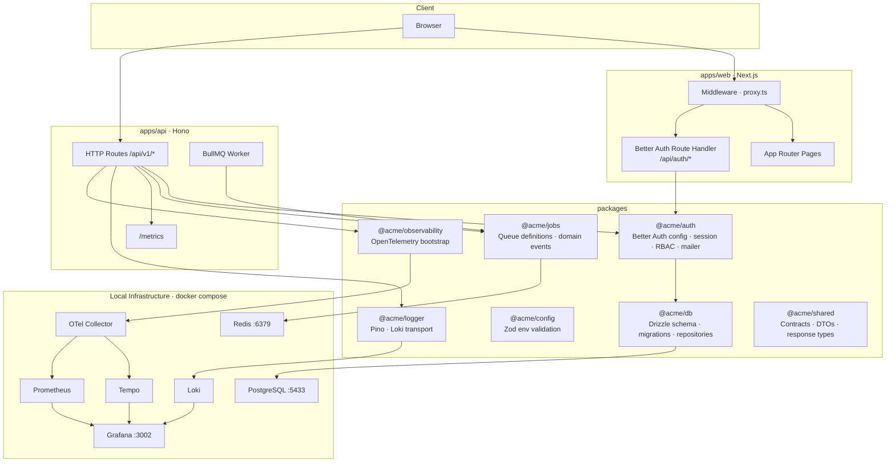

# Acme Platform

Production-grade SaaS monorepo starter. Scaffold it in one command and get a full-stack TypeScript platform with auth, async jobs, observability, and CI/CD wired up from day one.

```bash
npm create acme-platform@latest my-app
# or
pnpm create acme-platform my-app
# opt out of project agent skills
npx create-acme-platform my-app --no-skills
```

## What You Get

| Layer         | Technology                                                                    |
| ------------- | ----------------------------------------------------------------------------- |
| Frontend      | Next.js 16 App Router + Tailwind CSS + TanStack Query                         |
| API           | Hono on Node.js, versioned routes, Zod validation                             |
| Auth          | Better Auth — email/password, org RBAC, invitations, password reset           |
| Database      | PostgreSQL + Drizzle ORM — schema, migrations, repositories                   |
| Async         | Redis + BullMQ — queued invitation emails, outgoing webhooks                  |
| Observability | Grafana · Loki · Tempo · Prometheus · OpenTelemetry                           |
| Tooling       | Turborepo · pnpm workspaces · ESLint · Prettier · Husky · Vitest · Playwright |

## Architecture



### Request Path

```
Browser → middleware (cookie check) → Next.js page (SSR session validate)
                                    → Better Auth route handler → PostgreSQL

Browser → Hono API → session resolve → service → repository → PostgreSQL
                   → BullMQ job enqueue → Redis → Worker picks up → mailer / webhook delivery
                   → Pino logger → Loki
                   → OTel span → Collector → Tempo
```

## Workspace Layout

```
apps/
  api/          Hono API service + BullMQ worker entrypoint
  web/          Next.js frontend + Better Auth route handler
  web-e2e/      Playwright smoke tests

packages/
  auth/         Better Auth config, RBAC helpers, auth mailer
  config/       Zod-based env validation (shared across apps)
  db/           Drizzle schema, migrations, repositories
  cli/          TypeScript source for the create-acme-platform CLI
  jobs/         BullMQ queue definitions, domain event fan-out
  logger/       Pino structured logger + Loki transport
  observability/ OpenTelemetry bootstrap and span helpers
  shared/       Transport-neutral contracts, DTOs, response envelopes
  ui/           Shared React component primitives (shadcn-based)
  eslint-config/ Shared flat ESLint configs
  typescript-config/ Shared tsconfig presets

infra/
  observability/ Grafana, Loki, Tempo, Prometheus, OTel Collector config

skills-lock.json Agent skills manifest for scaffolded repos

scripts/
  build-create-package.mjs   Builds dist/create-acme-platform for npm publish
  verify-create-package.mjs  Smoke-tests the built CLI end-to-end
  write-release-notes.mjs    Extracts CHANGELOG entries for GitHub releases
```

## Quick Start

### Prerequisites

- Node.js 22+
- pnpm (`corepack enable && corepack prepare pnpm@latest --activate`)
- Docker Desktop or Docker Engine with Compose

### 1. Install

```bash
pnpm install
```

### 2. Create env files

```bash
cp .env.example .env
cp apps/api/.env.example apps/api/.env
cp apps/web/.env.example apps/web/.env
```

Fill in `BETTER_AUTH_SECRET` (32+ chars), `DATABASE_URL`, and either `RESEND_API_KEY` or SMTP credentials. Both `apps/web` and `apps/api` must share the same `BETTER_AUTH_SECRET`.

### 3. Start infrastructure

```bash
docker compose up -d
```

### 4. Set up the database

```bash
pnpm auth:generate   # regenerate Better Auth schema
pnpm db:generate     # generate Drizzle migration files
pnpm db:migrate      # apply migrations
```

### 5. Develop

```bash
pnpm dev
```

| Service    | URL                   |
| ---------- | --------------------- |
| Web        | http://localhost:3000 |
| API        | http://localhost:3001 |
| Grafana    | http://localhost:3002 |
| Prometheus | http://localhost:9090 |

## Common Commands

```bash
pnpm dev              # start all apps in watch mode
pnpm build            # production build (all packages + apps)
pnpm lint             # ESLint across workspace
pnpm typecheck        # tsc --noEmit across workspace
pnpm test             # Vitest across workspace (excludes e2e)
pnpm test:e2e         # Playwright smoke tests
pnpm format           # Prettier write
pnpm db:migrate       # apply Drizzle migrations
pnpm db:studio        # open Drizzle Studio
```

## Releasing the CLI

This repo publishes [`create-acme-platform`](https://www.npmjs.com/package/create-acme-platform) to npm.

```bash
pnpm release:patch    # bump patch, update CHANGELOG, create tag
pnpm release:minor    # bump minor
```

Pushing the `v*` tag triggers GitHub Actions, which runs the full CI gate and publishes `dist/create-acme-platform` to npm automatically. The pre-push hook blocks tag pushes unless `pnpm release:verify` passes first.

## Documentation

| Document                                                          | Description                                           |
| ----------------------------------------------------------------- | ----------------------------------------------------- |
| [Architecture](docs/architecture.md)                              | Package responsibilities, data flow, design decisions |
| [Getting Started](docs/getting-started.md)                        | Full setup guide — env vars, auth, database, Docker   |
| [Packages Reference](docs/packages.md)                            | What each workspace package owns and exports          |
| [Observability](docs/observability.md)                            | Grafana, Prometheus, Loki, Tempo usage guide          |
| [Releasing](docs/releasing.md)                                    | How to release the CLI, CI pipeline, npm publishing   |
| [Secrets Management](docs/operations/secrets-management.md)       | Secret classes, rotation rules, platform stores       |
| [Database Environments](docs/operations/database-environments.md) | Local, staging, production DB strategy                |
| [Async Platform](docs/operations/async-platform.md)               | BullMQ queues, worker, feature flags                  |

## License

MIT
