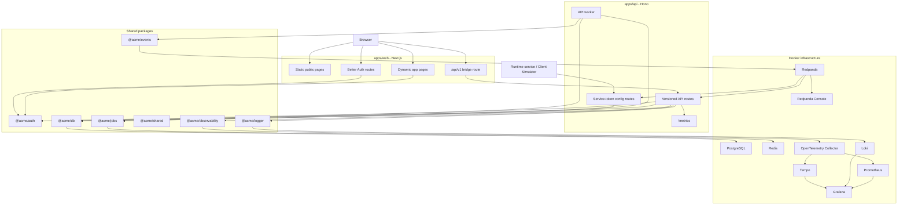

# No Reboot HQ

No Reboot HQ is a production-grade dynamic configuration control plane. It lets teams change runtime behavior, publish versioned config, protect secret values, and propagate updates to services without restarting them.

The project is intentionally built like a real backend platform, not a toy feature flag demo. It includes an authenticated dashboard, service-token client APIs, durable event delivery, worker-driven outbox publishing, live SSE reloads, and a full local observability stack.

## Built From The Scaffold

No Reboot HQ was built on top of the `create-acme-platform` scaffold. That CLI work came first: it gave this repository its monorepo shape, package boundaries, release tooling, shared configs, Docker infrastructure, and production-minded defaults.

Because the scaffold already handled the heavy platform foundation, this project could move faster into the interesting product layer: dynamic config, durable propagation, service tokens, live simulation, and observability. In that sense, No Reboot HQ is both a product and a proof of what the scaffold makes possible.

## The Pitch

Modern services need to change behavior while they are running. A payment service might need a feature flag flipped, a rollout percentage changed, or a secret rotated. Doing that safely means more than editing a JSON file.

No Reboot HQ gives you:

- versioned configuration entries per app and environment
- encrypted secret values
- scoped service tokens for runtime clients
- dashboard and service-client SSE streams
- durable config event publishing through Redpanda/Kafka
- transactional outbox processing through a background worker
- metrics, logs, and traces through Prometheus, Loki, Tempo, and Grafana
- a browser-based Client Simulator for live no-restart demos

## Real-Time Examples

The same mechanism works for many production situations. A config value changes in the dashboard, the API records a new version, the worker publishes the event, and subscribed services reload their snapshot without a deploy.

| Scenario             | Example config                        | What changes live                                                                         |
| -------------------- | ------------------------------------- | ----------------------------------------------------------------------------------------- |
| Checkout kill switch | `CHECKOUT_ENABLED=false`              | Disable a risky purchase path during an incident without restarting the checkout service. |
| Payment failover     | `PAYMENT_PROVIDER="stripe_backup"`    | Move traffic to a backup provider while the primary provider is degraded.                 |
| Progressive rollout  | `NEW_PRICING_ROLLOUT_PERCENT=10`      | Roll a pricing or feature change to 10 percent of users, then raise it gradually.         |
| Regional routing     | `INDIA_PAYMENT_GATEWAY="razorpay"`    | Route one region to a different provider while the rest of the world stays unchanged.     |
| Secret rotation      | `SENDGRID_API_KEY=<encrypted secret>` | Rotate a provider key and let services pick up the new value at runtime.                  |
| Rate limit tuning    | `FREE_PLAN_REQUESTS_PER_MINUTE=120`   | Tighten or relax throttles immediately during traffic spikes.                             |
| Incident mitigation  | `SEARCH_INDEXING_ENABLED=false`       | Turn off expensive background work while the platform is under pressure.                  |
| Experiment control   | `RECOMMENDATION_MODEL="v3"`           | Switch models or algorithms for a service without shipping a new build.                   |

## Quick Demo

Start everything:

```bash
docker compose up -d
pnpm dev
```

Then open:

```text
http://localhost:3000/configs
```

Demo flow:

1. Create or select an app and environment.
2. Write a config entry, such as `FEATURE_CHECKOUT_ENABLED=true`.
3. Create a service token.
4. Paste that token into **Client Simulator** on the same page.
5. Press **Start**.
6. Change the config entry again.
7. Watch the simulator receive the event and refresh the runtime snapshot.

Behind the scenes, the change moves through:

```text
Dashboard save
-> Hono API validation
-> Postgres config version
-> transactional outbox
-> API worker
-> Redpanda topic
-> SSE subscriber
-> simulator snapshot refresh
-> Prometheus metrics and Loki logs
```

That is the core "no reboot" story.

## Local UIs

| Surface          | URL                                 | What to show                                                |
| ---------------- | ----------------------------------- | ----------------------------------------------------------- |
| Web app          | http://localhost:3000               | Product overview, auth, dashboard shell                     |
| Config workspace | http://localhost:3000/configs       | Apps, environments, entries, versions, service tokens       |
| Client Simulator | http://localhost:3000/configs       | Paste a service token and watch live config propagation     |
| Health dashboard | http://localhost:3000/health        | Runtime health and platform checks                          |
| Users workspace  | http://localhost:3000/users         | Organization membership, roles, invitations, audit activity |
| API docs         | http://localhost:3000/api/v1/docs   | Generated API documentation                                 |
| API health       | http://localhost:3001/api/v1/health | Raw API health endpoint                                     |
| API metrics      | http://localhost:3001/metrics       | Prometheus scrape endpoint                                  |
| Redpanda Console | http://localhost:8080               | Kafka-compatible topics and messages                        |
| Prometheus       | http://localhost:9090               | Metrics queries and targets                                 |
| Grafana          | http://localhost:3002               | Metrics, logs, traces dashboards                            |
| Loki readiness   | http://localhost:3100/ready         | Log backend health check                                    |
| Tempo            | http://localhost:3200               | Trace backend API                                           |

Grafana defaults:

```text
admin / admin
```

## What Is Running

| Layer          | Technology                                          | Role                                                                   |
| -------------- | --------------------------------------------------- | ---------------------------------------------------------------------- |
| Frontend       | Next.js 16 App Router, Tailwind CSS, TanStack Query | Dashboard, auth pages, static public routes, live config UI            |
| API            | Hono on Node.js                                     | Versioned REST API, auth/session checks, service-token endpoints       |
| Auth           | Better Auth                                         | Email/password auth, organizations, roles, invitations, password reset |
| Database       | PostgreSQL and Drizzle ORM                          | Users, organizations, config state, versions, tokens, outbox           |
| Worker         | BullMQ and Redis                                    | Async jobs, invitation email flow, config outbox publisher             |
| Event backbone | Redpanda Kafka API                                  | Durable config event transport                                         |
| Live updates   | Server-Sent Events                                  | Dashboard and service-client propagation                               |
| Observability  | Prometheus, Grafana, Loki, Tempo, OpenTelemetry     | Metrics, logs, traces, request visibility                              |
| Tooling        | Turborepo, pnpm, ESLint, Vitest, Playwright         | Monorepo builds, checks, tests, automation                             |

## Architecture



## Runtime Config Flow

Config changes are stored first and published second. That is deliberate.

1. A dashboard user writes a config value.
2. The API validates the request and checks organization permissions.
3. A database transaction updates the current config entry, inserts an immutable version, and writes an outbox row.
4. The worker reads pending outbox rows.
5. The worker publishes config events to Redpanda.
6. Dashboard SSE streams and service-client SSE streams receive scoped events.
7. Runtime clients refetch their snapshot and continue without a restart.

Service clients use:

```text
GET /api/v1/client/config
GET /api/v1/client/config/events
Authorization: Bearer <service-token>
```

The browser Client Simulator uses the same contract as a real backend service. No terminal `CONFIG_SERVICE_TOKEN` is needed for the interactive demo.

## Rendering Strategy

The web app is split into route groups:

```text
app/
  (public)/   static public and auth pages
  (app)/      session-aware dashboard pages
```

Static pages:

- `/`
- `/sign-in`
- `/sign-up`
- `/forgot-password`
- `/reset-password`
- `/_not-found`

Dynamic pages:

- `/configs`
- `/users`
- `/health`
- `/onboarding`
- `/accept-invite`
- API route handlers

This keeps the public surface fast while preserving request-time session checks for workspace pages.

## Repository Layout

```text
apps/
  api/               Hono API and worker entrypoints
  config-simulator/  CLI service-token simulator
  web/               Next.js dashboard and auth routes
  web-e2e/           Playwright smoke tests

packages/
  auth/              Better Auth config, RBAC helpers, mailer integration
  config/            Zod env loading and validation
  db/                Drizzle schema, migrations, repositories
  events/            Redpanda/Kafka producer and consumer helpers
  jobs/              BullMQ queues and job contracts
  logger/            Pino logger and Loki transport
  observability/     OpenTelemetry bootstrap
  shared/            DTOs, schemas, API response contracts
  ui/                Shared UI primitives

infra/
  observability/     Prometheus, Grafana, Loki, Tempo, OTel config
```

## Setup

### Prerequisites

- Node.js 22+
- pnpm 10+
- Docker Desktop or Docker Engine with Compose

Enable pnpm through Corepack if needed:

```bash
corepack enable
corepack prepare pnpm@latest --activate
```

### Install

```bash
pnpm install
```

### Environment Files

Create local env files:

```bash
cp .env.example .env
cp apps/api/.env.example apps/api/.env
cp apps/web/.env.example apps/web/.env
```

PowerShell:

```powershell
Copy-Item .env.example .env
Copy-Item apps/api/.env.example apps/api/.env
Copy-Item apps/web/.env.example apps/web/.env
```

Important values:

- `BETTER_AUTH_SECRET` must match in `apps/api/.env` and `apps/web/.env`.
- `DATABASE_URL` should point at local Postgres.
- `APP_ORIGIN`, `API_CORS_ORIGIN`, `BETTER_AUTH_URL`, and `API_UPSTREAM_URL` should point at localhost during development.
- Set `API_LOG_TO_LOKI=true` in `apps/api/.env` if you want API logs in Grafana.

Generate a local auth secret:

```bash
openssl rand -base64 32
```

PowerShell:

```powershell
[Convert]::ToBase64String((1..32 | ForEach-Object { Get-Random -Minimum 0 -Maximum 256 }))
```

### Start Infrastructure

```bash
docker compose up -d
```

### Database

```bash
pnpm auth:generate
pnpm db:generate
pnpm db:migrate
```

### Start Development

```bash
pnpm dev
```

This starts the web app, API, and API worker through Turborepo.

## Common Commands

```bash
pnpm dev              # start web, API, and worker in watch mode
pnpm build            # production build
pnpm lint             # lint all packages
pnpm typecheck        # TypeScript check all packages
pnpm test             # Vitest test suite, excluding e2e
pnpm test:e2e         # Playwright tests
pnpm db:migrate       # apply database migrations
pnpm db:studio        # open Drizzle Studio
```

CLI simulator:

```bash
CONFIG_SERVICE_TOKEN=<token> pnpm --filter @acme/config-simulator start
```

For most demos, prefer the browser Client Simulator at:

```text
http://localhost:3000/configs
```

## Observability

Prometheus metrics:

```text
http://localhost:9090
```

Useful queries:

```promql
no_reboot_hq_api_config_sse_connections
no_reboot_hq_api_config_snapshots_total
increase(no_reboot_hq_api_config_snapshots_total[10m])
no_reboot_hq_api_http_requests_total{route="/api/v1/client/config"}
no_reboot_hq_api_http_requests_total{route="/api/v1/client/config/events"}
```

Grafana:

```text
http://localhost:3002
```

Loki logs query:

```logql
{service="no-reboot-hq-api"}
```

If Grafana has no API logs:

1. Set `API_LOG_TO_LOKI=true` in `apps/api/.env`.
2. Confirm `LOKI_URL=http://localhost:3100`.
3. Restart the API.
4. Trigger an API request.

Loki has no UI at `/`; use Grafana for logs or check readiness directly:

```text
http://localhost:3100/ready
```

## First User Flow

1. Open `http://localhost:3000/sign-up`.
2. Create an account.
3. Open `http://localhost:3000/onboarding`.
4. Create an organization.
5. Open `http://localhost:3000/configs`.
6. Create an app, environment, config entries, and a service token.

## Why This Is Interesting

No Reboot HQ demonstrates several production patterns working together:

- auth and organization scoping
- type-safe contracts shared across web, API, and clients
- transactional outbox for reliable event publication
- Kafka-compatible propagation through Redpanda
- service-token runtime access
- live SSE updates without polling
- metrics, logs, and traces ready for inspection
- static public pages and dynamic authenticated workspace pages

It is a compact platform that feels like a slice of a real internal developer product.

## Documentation

| Document                                                          | Description                                   |
| ----------------------------------------------------------------- | --------------------------------------------- |
| [Getting Started](docs/getting-started.md)                        | Full local setup guide                        |
| [Architecture](docs/architecture.md)                              | Package responsibilities and design decisions |
| [Packages Reference](docs/packages.md)                            | Workspace package map                         |
| [Observability](docs/observability.md)                            | Prometheus, Grafana, Loki, Tempo              |
| [Async Platform](docs/operations/async-platform.md)               | BullMQ, workers, async jobs                   |
| [Secrets Management](docs/operations/secrets-management.md)       | Secret classes and rotation rules             |
| [Database Environments](docs/operations/database-environments.md) | Local, staging, production DB strategy        |
| [Releasing](docs/releasing.md)                                    | Release workflow for scaffold tooling         |

## License

MIT
